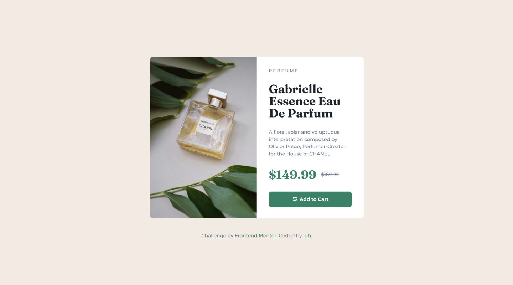

# Frontend Mentor - Product preview card component solution

This is a solution to the [Product preview card component challenge on Frontend Mentor](https://www.frontendmentor.io/challenges/product-preview-card-component-GO7UmttRfa). Frontend Mentor challenges help you improve your coding skills by building realistic projects.

## Table of contents

- [Overview](#overview)
  - [The challenge](#the-challenge)
  - [Screenshot](#screenshot)
  - [Links](#links)
- [My process](#my-process)
  - [Built with](#built-with)
  - [What I learned](#what-i-learned)
  - [Continued development](#continued-development)
  - [Useful resources](#useful-resources)
- [Author](#author)
- [Acknowledgments](#acknowledgments)

**Note: Delete this note and update the table of contents based on what sections you keep.**

## Overview

### The challenge

Users should be able to:

- View the optimal layout depending on their device's screen size
- See hover and focus states for interactive elements

### Screenshot

### Links

- Solution URL: [solution URL](https://github.com/LukeDHarrison/product-card-frontend-mentor-solution)
- Live Site URL: [live site URL](https://product-card-frontend-mentor-solution.netlify.app/)

## My process

### Built with

- Semantic HTML5 markup
- CSS custom properties
- Flexbox
- CSS Variables

### What I learned

Working with images can be tricky. It can be tempting to throw
a background image on a div and move on. But using true images
is important for accessability. It always good to practice using
images in different projects and ensuring they adapt correctly
to different screen sizes.

### Useful resources

This article from CSS Tricks was helpful in identifying the
"object-position" property. 

## Author

- Website - [Luke D Harrison](https://www.your-site.com)
- Frontend Mentor - [@LukeDHarrison](https://www.frontendmentor.io/profile/LukeDHarrison)
- Twitter - [@LukeDHarrison\_](https://twitter.com/LukeDHarrison_)
